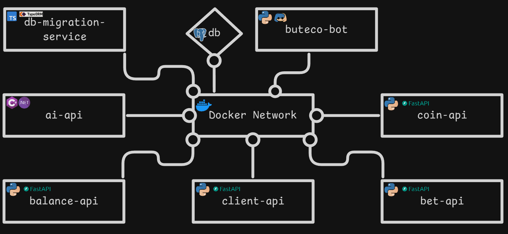

# Chorume Bot Ecosystem

A comprehensive Discord bot ecosystem built with Docker containers, featuring economy management, daily rewards, user transfers, AI integration, and a robust microservices architecture.

## 🎮 Discord Bot Features

The Chorume Bot provides a complete economy system and AI assistant through Discord slash commands:

### 💰 Economy Commands
- `/register` - Join the economy system
- `/daily` - Claim daily coins (100 coins/day)
- `/balance [user]` - Check coin balance
- `/transfer <user> <amount>` - Send coins to other users
- `/leaderboard` - View top users by balance
- `/history` - View transaction history

### 🤖 AI Commands
- `/ai <prompt> [provider] [system_prompt] [model]` - Ask the AI (OpenAI, Gemini, etc.) any question or request

### 📊 Information Commands  
- `/status` - Check all microservices health
- `/help` - Show all available commands
- `/daily_history` - View daily claim history

## 🚀 Quick Start

1. **Setup the system:**
   ```bash
   ./setup.sh
   ```

2. **Configure Discord bot:**
   - Get bot token from [Discord Developer Portal](https://discord.com/developers/applications)
   - Edit `.env` file with your `DISCORD_TOKEN` and any AI API keys
   - Invite bot to your server with slash command permissions

3. **Start using:**
   ```
   /register    # Join the economy
   /daily       # Get your first coins
   /balance     # Check your wealth
   /ai          # Use the AI assistant
   ```

## Architecture

The system uses a microservices architecture with Docker containers communicating through a shared network. Each container is independently deployable and scalable, making it easy to add new features or support additional programming languages.

for implement the your microsservice see the [MICROSERVICE_GUIDE](MICROSERVICE_GUIDE.md) 



## Features

- Virtual coin system with daily rewards
- Peer-to-peer coin transfers
- Betting system
- AI assistant (OpenAI, Gemini, etc.)
- Leaderboard and transaction history
- Comprehensive command system
- Rich embed responses
- Error handling and status monitoring
- User-friendly help system

## Microservices

Each microservice has its own README with usage and endpoints:
- `client_api/README.md` - User management
- `balance_api/README.md` - Balance and transactions
- `coin_api/README.md` - Daily coins
- `bet_api/README.md` - Betting system
- `genai_api/README.md` - AI assistant

## Development & Contribution

- Follow PEP 8 for Python code
- Add docstrings and error handling
- Test API endpoints and bot commands
- See each microservice's README for details

## Troubleshooting

- Check the troubleshooting section in each README
- View container logs:
  ```bash
  docker-compose logs [service-name]
  ```
- Health check example:
  ```bash
  curl http://localhost:8005/health
  ```

## License

This project is open source and available under the MIT License.

---
*Built with ❤️ using Docker, Python, Discord.py, and FastAPI*
